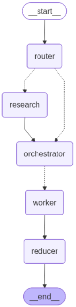

# 📝 Multi-Agent Research-Aware Blog Generator

An intelligent multi-agent blog generation system built using **LangGraph**, **Groq LLMs**, and **Tavily Search**.

The system automatically decides whether web research is required, gathers evidence when necessary, creates a structured content plan, generates sections in parallel, and compiles them into a publication-ready markdown article.

---

## 🚀 Features

### 🧠 Intelligent Routing

Before planning the article, a Router Agent determines:

- Whether external research is required
- Which generation mode to use:
  - Closed Book
  - Hybrid
  - Open Book

- High-signal search queries for research

---

### 🔍 Automated Research

When research is needed:

- Generates targeted search queries
- Retrieves information using Tavily Search
- Deduplicates sources
- Creates structured evidence packs
- Filters low-quality information

---

### 📋 Content Planning Agent

Creates a complete blog blueprint:

- SEO-friendly title
- Target audience
- Writing tone
- Article goal
- Total word count
- Detailed section plans

Each section contains:

- Title
- Section type
- Brief
- Target word count
- Key points to cover

---

### ⚡ Parallel Section Generation

Uses LangGraph fan-out/fan-in architecture.

Each section is written independently by a Worker Agent.

Benefits:

- Faster generation
- Better specialization
- Cleaner section boundaries
- Improved scalability

---

### 📚 Evidence-Aware Writing

Workers can utilize research evidence to:

- Add recent developments
- Include benchmarks
- Reference industry trends
- Improve factual grounding

---

### 📝 Markdown Export

Generated articles are automatically:

- Merged into a final document
- Saved as Markdown files
- Ready for blogs, documentation, or publishing

---

## 🏗 Architecture

<p align="center">
  
</p>



```text
START
  │
  ▼
Router Agent
  │
  ├───────────────┐
  │               │
  ▼               ▼
Research      Orchestrator
  │               ▲
  └───────────────┘
          │
          ▼
      Fan-Out
          │
 ┌────────┼────────┐
 ▼        ▼        ▼
Worker  Worker  Worker
  │        │        │
  └────────┼────────┘
           ▼
        Reducer
           ▼
          END
```

---

## 🧩 Components

### Router Agent

Determines:

- Research requirements
- Research mode
- Search queries

Output:

```python
RouterDecision
```

---

### Research Agent

Collects:

- Articles
- Reports
- Documentation
- Benchmarks

Output:

```python
EvidencePack
```

---

### Orchestrator Agent

Creates:

```python
Plan
```

Including:

```python
Task
```

objects for each section.

---

### Worker Agents

Responsible for:

- Writing assigned section
- Following section brief
- Maintaining tone
- Using evidence when needed

Output:

```python
{
    "sections": [section_markdown]
}
```

---

### Reducer Agent

Responsible for:

- Combining sections
- Building final article
- Exporting markdown file

Output:

```python
{
    "final": final_markdown
}
```

---

## 📦 Tech Stack

- Python
- LangGraph
- LangChain
- Groq LLM
- Tavily Search
- Pydantic
- dotenv

---

## ⚙️ Installation

### Clone Repository

```bash
git clone https://github.com/yourusername/blog-agent.git

cd blog-agent
```

### Create Virtual Environment

```bash
python -m venv venv
```

### Activate Environment

Windows:

```bash
venv\Scripts\activate
```

Linux/Mac:

```bash
source venv/bin/activate
```

---

## 🔑 Environment Variables

Create a `.env` file.

```env
GROQ_API_KEY=your_groq_key
TAVILY_API_KEY=your_tavily_key
```

---

## ▶️ Usage

```python
result = app.invoke(
    {
        "topic": "Self Attention in AI"
    }
)
```

Access generated article:

```python
print(result["final"])
```

---

## Example Topics

- Self Attention in AI
- LangGraph for Production Agents
- Retrieval-Augmented Generation
- MCP Architecture
- AI Agents in 2026
- FastAPI Best Practices
- Vector Databases Explained
- Multi-Agent Systems

---

## Future Improvements

- Citation Generation
- Source Attribution
- Fact Verification Agent
- Human Review Agent
- SEO Optimization Agent
- Image Generation Agent
- PDF Export
- DOCX Export
- Multi-Language Support
- Streaming Article Generation

---

## License

MIT License

---

## Author

Built with ❤️ using LangGraph, Groq, and Tavily.
